# Unsupervised Confidence Estimation
### Uncertainty Quantification & Unsupervised Confidence Estimation

<p align="left">
  
  
  
  
  
</p>

> **Can a neural network know when it doesn't know?**
> This project benchmarks four uncertainty quantification paradigms and introduces a **novel unsupervised confidence metric** that estimates model reliability without ever using ground-truth labels - applicable across all UQ architectures.

---

## Table of Contents

- [Overview](#overview)
- [Motivation](#motivation)
- [Novel Contribution](#novel-contribution)
- [Methods](#methods)
- [Results](#results)
- [Visualizations](#visualizations)
- [Repository Structure](#repository-structure)
- [Installation](#installation)
- [Usage](#usage)
- [Ablation Studies](#ablation-studies)
- [Related Work](#related-work)
- [Citation](#citation)
- [License](#license)

---

## Overview

Standard neural networks are overconfident by design - their softmax outputs are routinely miscalibrated, assigning high confidence to incorrect predictions and low confidence to correct ones. This becomes critical in deployment: a model that cannot self-assess its own uncertainty is not safe to trust.

This project provides:

1. A **rigorous comparative evaluation** of four established UQ methods (MSP Baseline, MC Dropout, Evidential Deep Learning, Deep Ensembles) on CIFAR-10 (in-distribution) vs CIFAR-100 (out-of-distribution).
2. A **novel unsupervised confidence metric** that estimates model confidence using only the model's own internal signals - no labels, no human annotation, no held-out data required.
3. **Comprehensive ablation studies** validating every component of the proposed metric.

**Benchmark:** CIFAR-10 (ID) vs CIFAR-100 (OOD) · 100 training epochs · 10 classes

---

## Motivation

Uncertainty quantification in deep learning is a well-studied problem, but existing approaches share a fundamental limitation: **evaluation requires labels**. In real-world deployment - medical imaging, autonomous systems, financial prediction - you rarely have access to ground truth at inference time.

The core question driving this work:

> *Can we construct a confidence signal that correlates with true model errors, using only the model's own outputs and representations?*

This project answers yes - and demonstrates it empirically across four different UQ architectures.

---

## Novel Contribution

### Unsupervised Confidence Metric

The proposed metric combines four label-free signals into a unified confidence score:

| Component | What It Captures |
|---|---|
| **Prediction Consistency** | Stability of predictions across augmented views of the same input |
| **Entropy-Based Uncertainty** | Information-theoretic uncertainty from the output distribution |
| **Feature Space Dispersion** | Spread of representations in the penultimate layer |
| **Softmax Temperature Analysis** | Sharpness of the output distribution under temperature scaling |

**Key result:** The metric achieves Spearman correlations of up to **ρ = 0.4221** with true model errors - without using a single label. Q4 accuracy (confidence in the top quartile of predictions) reaches **99.92%** under MC Dropout.

| Method | Spearman ρ ↑ | Q4 Accuracy ↑ |
|---|---|---|
| Baseline | 0.4115 | 99.68% |
| MC Dropout | **0.4221** | **99.92%** |
| Evidential | 0.3708 | 98.60% |
| Ensemble | 0.4127 | 99.68% |

The metric is **architecture-agnostic** - it plugs into any of the four UQ methods evaluated here without modification.

---

## Methods

### 1. Baseline - Maximum Softmax Probability (MSP)
Uses the maximum softmax output as a proxy for confidence. Fast, parameter-free, and a strong baseline despite its simplicity. Achieves competitive OOD detection (AUROC 0.8549) at near-zero inference overhead (0.25ms).

### 2. Monte Carlo Dropout (MC Dropout)
Treats dropout as approximate Bayesian inference. Runs N stochastic forward passes at test time, using variance across passes as the uncertainty estimate. Best calibration in the benchmark (ECE: **0.0097**) - an order of magnitude better than other methods - at the cost of higher inference time (5.40ms).

### 3. Evidential Deep Learning (EDL)
Places a Dirichlet distribution over the softmax outputs, modeling second-order uncertainty from a single forward pass. Achieves the **highest accuracy (91.66%)** in the benchmark. Uncertainty is derived from the concentration parameters of the learned Dirichlet, not from stochastic sampling.

### 4. Deep Ensembles
Trains multiple independent models and uses disagreement across predictions as the uncertainty signal. Matches Baseline on AUROC and accuracy while providing well-calibrated ensemble uncertainty. Higher compute at training time; moderate inference overhead (0.85ms).

---

## Results

### Classification Performance

| Method | Accuracy ↑ | ECE ↓ | OOD AUROC ↑ | Inference (ms) |
|---|---|---|---|---|
| Baseline (MSP) | 91.14% | 0.0323 | **0.8549** | 0.25 |
| MC Dropout | 90.78% | **0.0097** | 0.8531 | 5.40 |
| Evidential (EDL) | **91.66%** | 0.0742 | 0.8440 | 0.25 |
| Deep Ensemble | 91.14% | 0.0323 | 0.8549 | 0.85 |

### Key Findings

- **Best Accuracy:** Evidential Deep Learning - 91.66%
- **Best Calibration:** MC Dropout - ECE of 0.0097 (3× lower than the next best)
- **Best OOD Detection:** Baseline & Ensemble - AUROC 0.8549
- **Best Unsupervised Metric Correlation:** MC Dropout - ρ = 0.4221
- **Fastest Inference:** Baseline & Evidential - 0.25ms per sample

### Practical Takeaway

No single method dominates across all axes. MC Dropout is the best overall uncertainty estimator (calibration + unsupervised metric) at the cost of 20× inference overhead. Evidential Deep Learning is the strongest single-model classifier with no inference penalty. Ensembles offer a calibration-accuracy balance at moderate cost.

---

## Visualizations

### Method Comparison - Accuracy / ECE / AUROC

[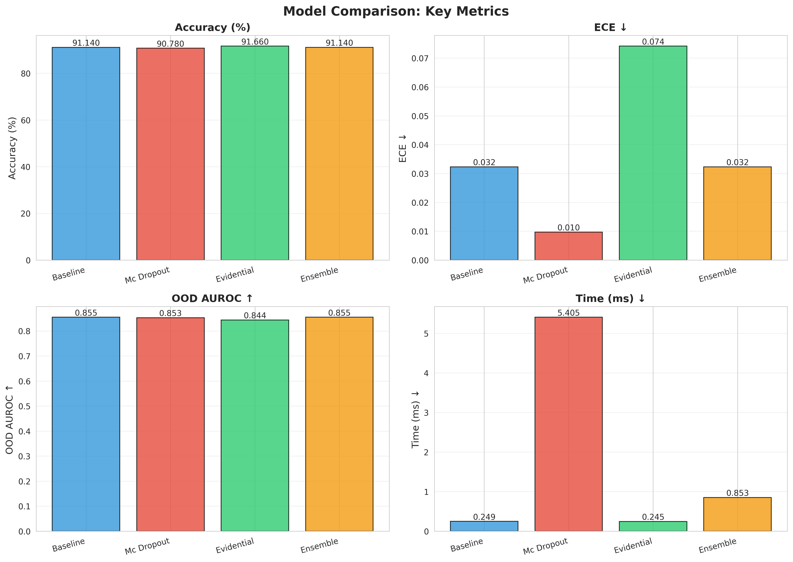](images/comparison_metrics.png)

*Side-by-side comparison of key metrics across all four UQ methods.*

---

### Confidence Distributions & Unsupervised Metric Behavior

[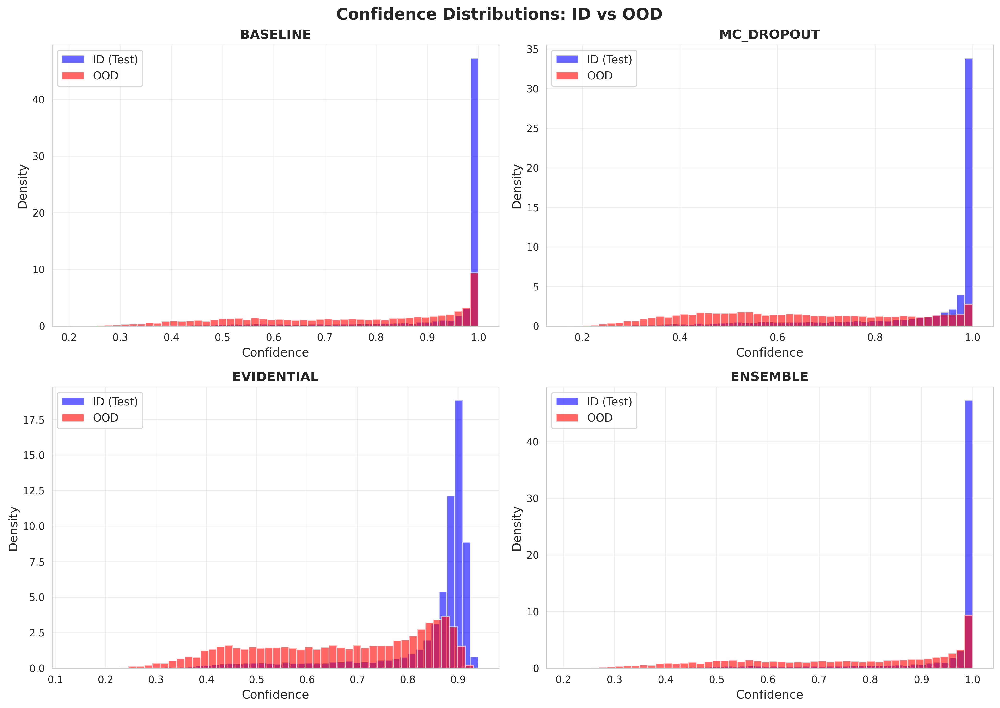](images/confidence_distributions.png)

*Predicted confidence histograms and unsupervised confidence score distributions across ID and OOD datasets.*

---

### OOD Detection - ROC Curves (CIFAR-10 ID vs CIFAR-100 OOD)

[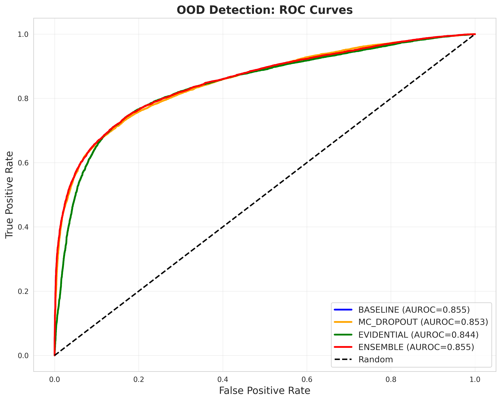](images/ood_roc_curves.png)

*ROC curves for all four methods. AUROC measures separability between in-distribution and out-of-distribution samples.*

---

### Training Curves

<p>
  <a href="images/Baseline_training_curves.png">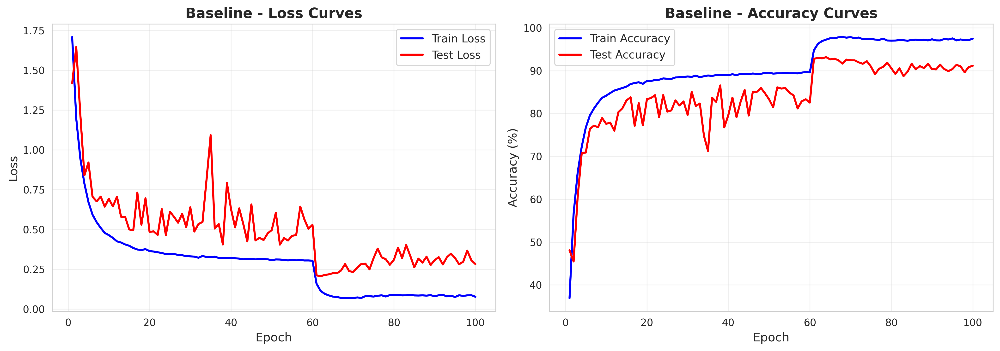</a>
  <a href="images/MC Dropout_training_curves.png"></a>
  <a href="images/Evidential_training_curves.png">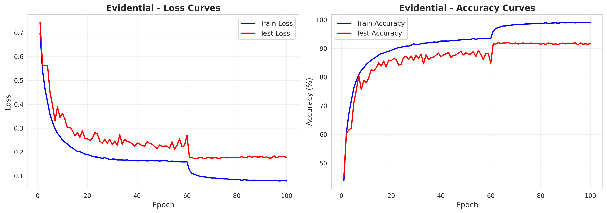</a>
</p>

---

### Reliability Diagrams

Reliability diagrams measure calibration quality - a perfectly calibrated model lies on the diagonal. MC Dropout's diagram shows near-perfect alignment.

<p>
  <a href="images/BASELINE_reliability_diagram.png">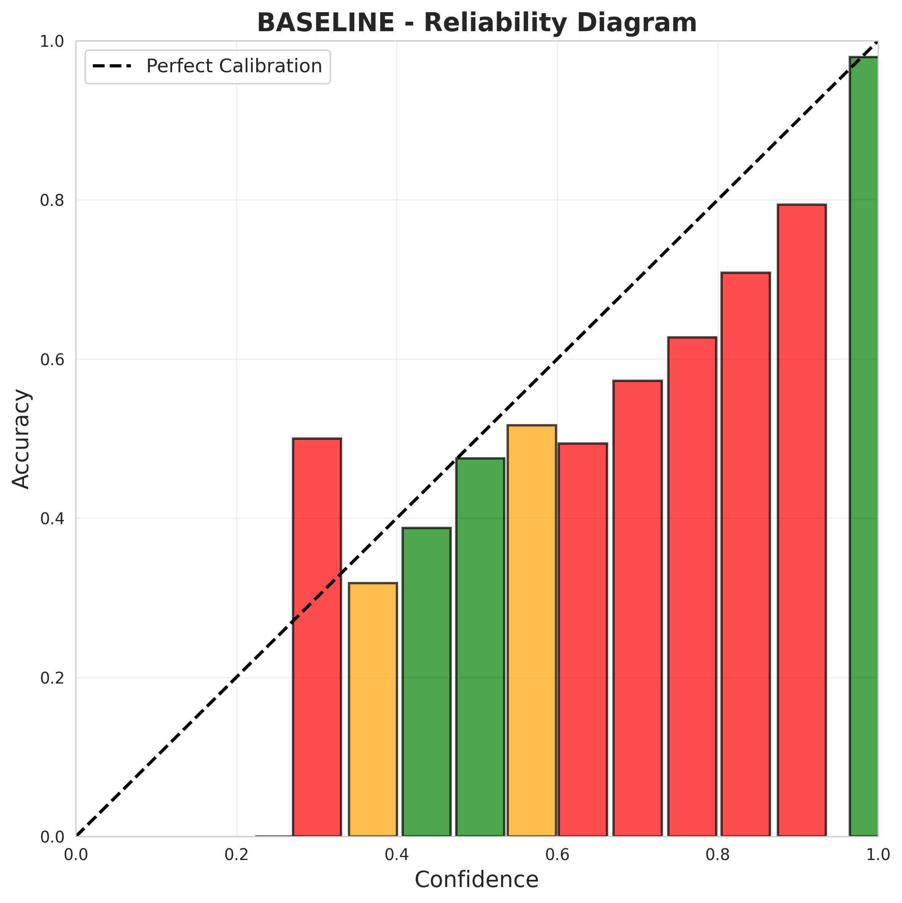</a>
  <a href="images/MC_DROPOUT_reliability_diagram.png">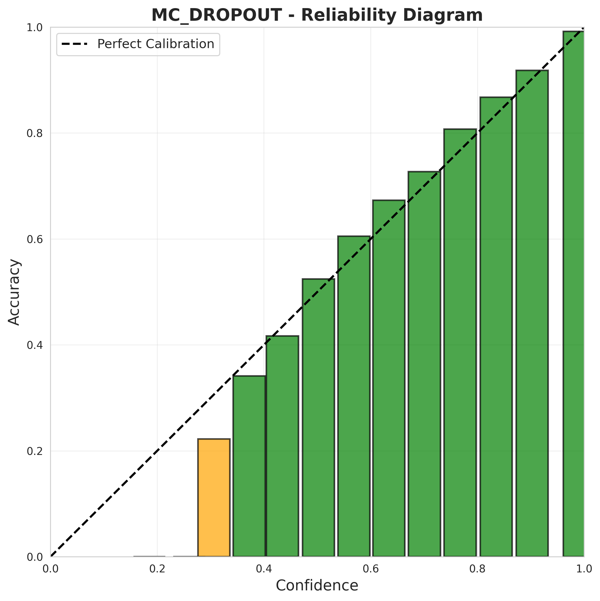</a>
  <a href="images/EVIDENTIAL_reliability_diagram.png">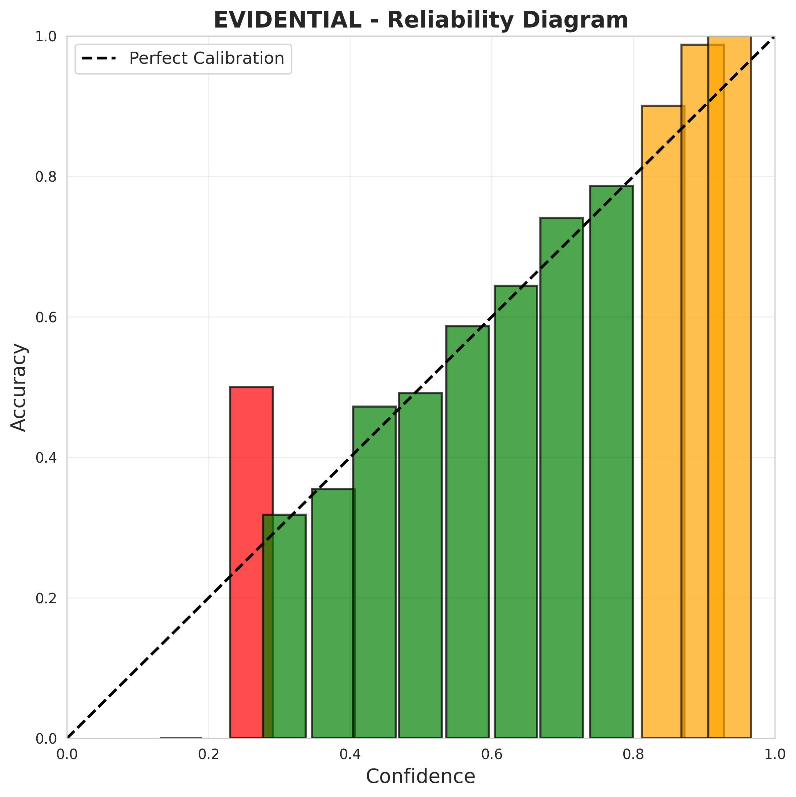</a>
  <a href="images/ENSEMBLE_reliability_diagram.png">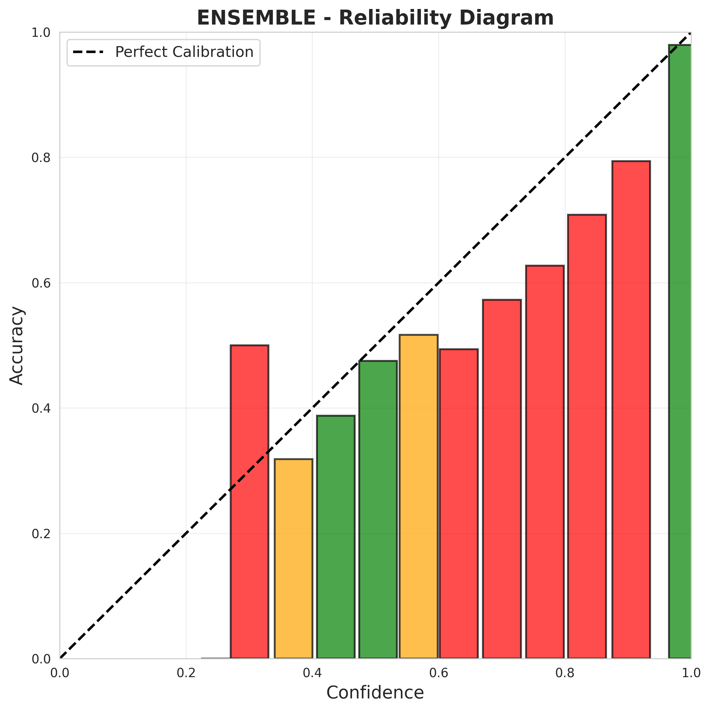</a>
</p>

*Left to right: Baseline · MC Dropout · Evidential · Ensemble*

---

### Unsupervised Metric Analysis - Per Method

<p>
  <a href="images/baseline_unsupervised_analysis.png">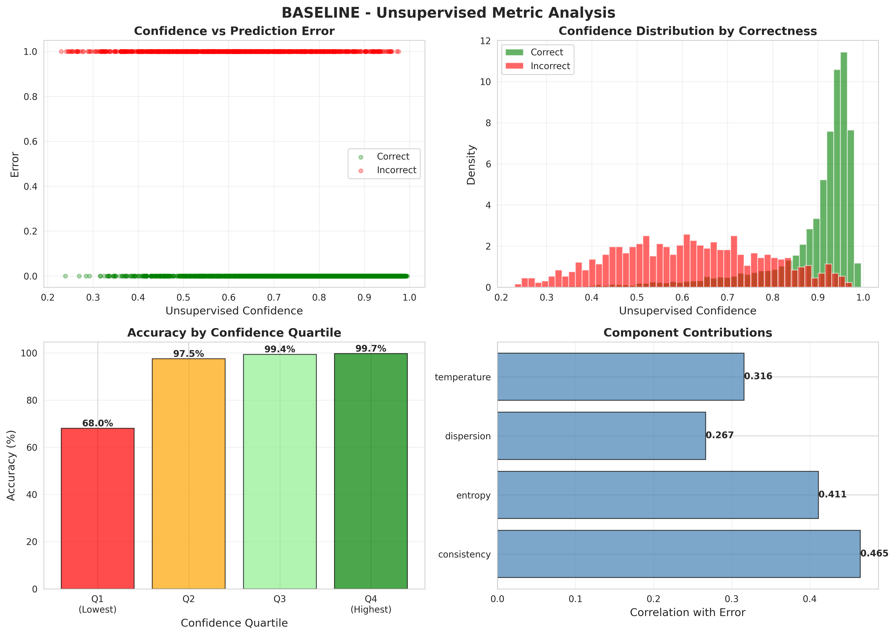</a>
  <a href="images/mc_dropout_unsupervised_analysis.png">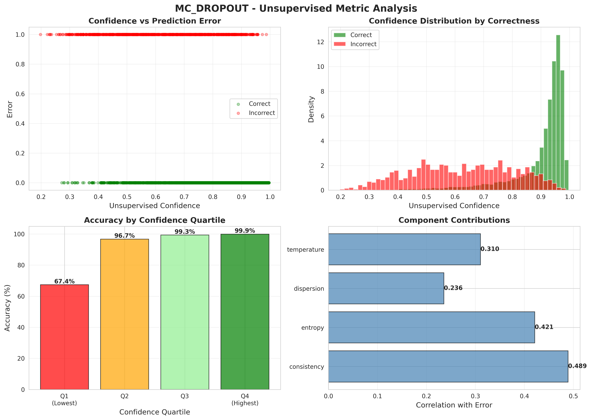</a>
  <a href="images/evidential_unsupervised_analysis.png">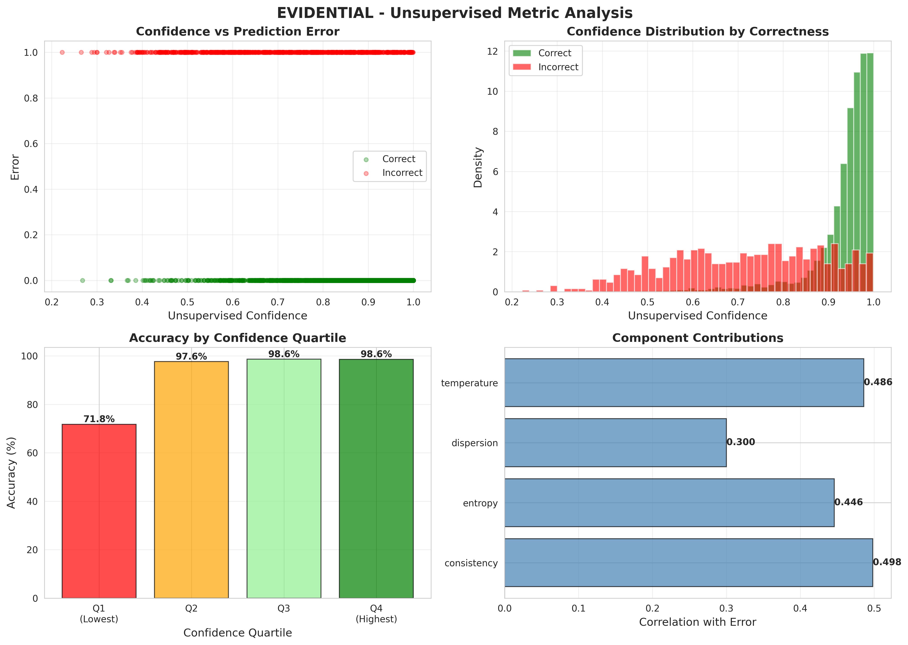</a>
  <a href="images/ensemble_unsupervised_analysis.png"></a>
</p>

*Unsupervised confidence score behavior per method - showing correlation with true error rates.*

---

## Repository Structure

```
unsupervised-confidence-estimation/
│
├── unsupervised_confidence_estimation.ipynb   # Main pipeline notebook
├── final_report.txt                              # Full quantitative results
│
├── checkpoints/                                  # Pretrained model weights
│   ├── baseline_model.pth
│   ├── mc_dropout_model.pth
│   └── evidential_model.pth
│
├── ensemble_model/                               # Ensemble member weights
│   └── ensemble_model_*.pth
│
├── images/                                       # All figures and plots
│   ├── comparison_metrics.png
│   ├── confidence_distributions.png
│   ├── ood_roc_curves.png
│   ├── *_training_curves.png
│   ├── *_reliability_diagram.png
│   ├── *_unsupervised_analysis.png
│   └── ablation_*.png
│
└── LICENSE
```

### Core Modules

| Module | Role |
|---|---|
| `DatasetManager` | CIFAR-10/100 loading, augmentation pipelines |
| `BaselineModel` | MSP confidence estimation |
| `MCDropoutModel` | Stochastic inference with dropout |
| `EvidentialModel` | Dirichlet-based uncertainty output |
| `DeepEnsemble` | Multi-model ensemble training and inference |
| `UnsupervisedConfidenceMetric` | Novel label-free confidence estimation |
| `ComprehensiveEvaluator` | ECE, AUROC, Spearman ρ, Q4 accuracy |
| `AblationStudies` | Component-level ablations for the proposed metric |
| `Visualizer` | All plots and reliability diagrams |

---

## Installation

```bash
# Create and activate a virtual environment
python -m venv .venv
source .venv/bin/activate          # Linux/macOS
.\.venv\Scripts\Activate.ps1       # Windows PowerShell

# Install dependencies
pip install numpy scipy scikit-learn matplotlib seaborn tqdm tensorboard

# Install PyTorch - match your CUDA version
# See https://pytorch.org/get-started/locally/ for the right wheel
pip install torch torchvision
```

**Requirements:** Python 3.9+ · PyTorch 2.0+ · CUDA optional (CPU-compatible)

---

## Usage

Open `unsupervised_confidence_estimation.ipynb` in Jupyter or VS Code and run cells sequentially. The `main_pipeline()` function orchestrates the full experiment.

```python
models, results, unsupervised_results, evaluator = main_pipeline(
    train_models=False,     # set True to retrain from scratch
    num_epochs=100,
    run_ablations=True,
    id_dataset='cifar10',
    ood_dataset='cifar100',
    batch_size=128
)
```

**Flags:**
- `train_models=False` - loads pretrained checkpoints from `checkpoints/`, skips retraining
- `run_ablations=True` - runs full ablation suite on the unsupervised metric
- `FAST_DEBUG_SUBSET=1` (env var) or `--smoke-test` flag - runs on a data subset for quick validation

---

## Ablation Studies

Three ablation axes validate the design of the unsupervised confidence metric:

| Ablation | Variable | Finding |
|---|---|---|
| Dropout Rate | MC Dropout inference stochasticity | Optimal range: 0.1–0.3 |
| Ensemble Size | Number of ensemble members | Diminishing returns beyond 5 |
| Component Weights | Relative contribution of each metric signal | Entropy + consistency dominate |

Full ablation plots in `images/ablation_*.png`.

<p>
  <a href="images/ablation_dropout_rate.png">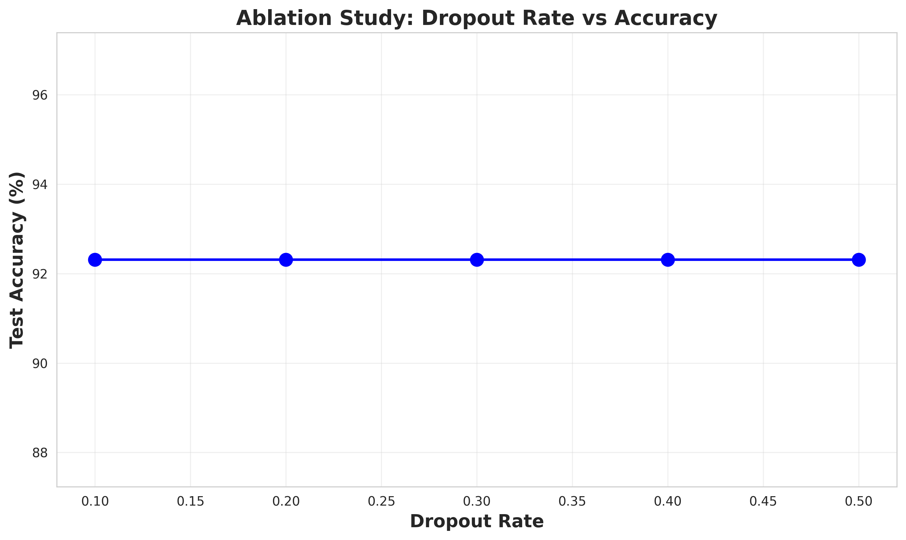</a>
  <a href="images/ablation_ensemble_size.png">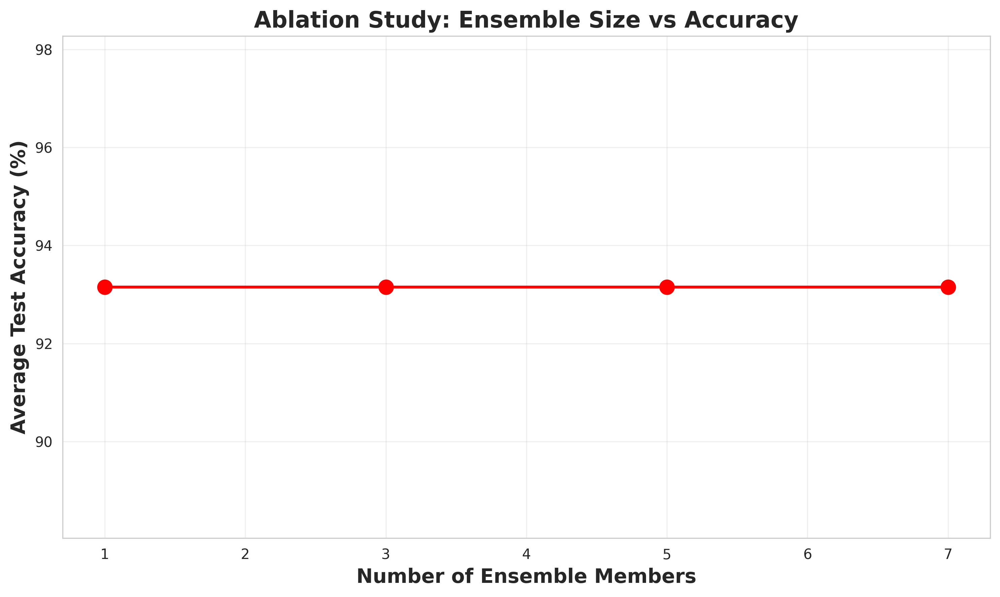</a>
  <a href="images/ablation_unsupervised_weights.png">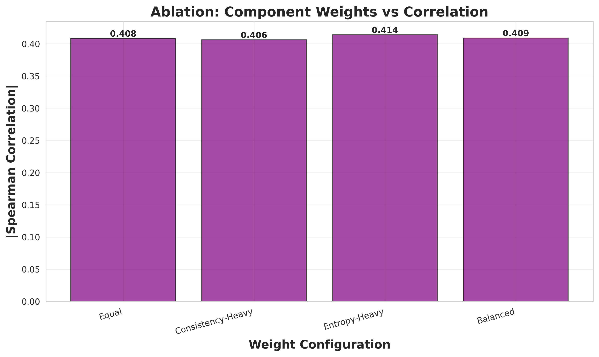</a>
</p>

---

## Related Work

- [Unified Time Series Foundation Model](https://github.com/royxforge/unified-time-series-foundation-model) - The per-horizon confidence calibration in UniTSFM's uncertainty-weighted ensemble shares methodology with the unsupervised confidence metric developed here.

---

## Citation

If you use this work or build on the unsupervised confidence metric, please cite:

```bibtex
@misc{roy2025unsupervisedconfidenceestimation,
  title        = {Unsupervised Confidence Estimation: Uncertainty Quantification and Unsupervised Confidence Estimation},
  author       = {Sourav Roy},
  year         = {2025},
  note         = {Preprint. Available at: https://github.com/royxforge/unsupervised-confidence-estimation.git}
}
```

---

## License

This project is licensed under the MIT License - see [LICENSE](./LICENSE) for details.

---

<p align="center">
  <sub>Built by <a href="https://github.com/royxforge">Sourav Roy</a> · Artificial Intelligence Engineer · Accure Inc.</sub>
</p>
