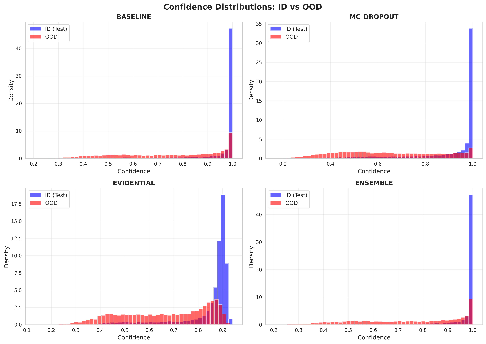

# Self-Diagnosing Neural Models: Uncertainty Quantification & Unsupervised Confidence Estimation

[](./LICENSE)

Author: Sourav Roy  
Email: royxlead@proton.me  
Date: October 2025

---

## Project Overview

This repository contains a complete implementation and evaluation suite for "Self-Diagnosing Neural Models": uncertainty quantification (UQ) methods and a novel unsupervised confidence metric that estimates model confidence without using labels. The project includes:

- Implementations of multiple UQ methods: Baseline (MSP), Monte Carlo Dropout (MC Dropout), Evidential Deep Learning (EDL), and Deep Ensembles.
- A novel unsupervised confidence metric combining prediction consistency across augmentations, entropy, feature-space dispersion, and softmax temperature analysis.
## Quick highlights (numbers taken from `final_report.txt`)

- Dataset: CIFAR-10 (ID) vs CIFAR-100 (OOD)
- Training epochs reported: 100
- Best single-model accuracy: Evidential (≈91.7%)
- Best calibration (lowest ECE): MC Dropout (≈0.0097)
- Best OOD detection AUROC (≈0.855): Baseline / Ensemble

### Installation (minimal)

Create and activate a virtual environment and install the core packages. Adjust the torch wheel for your CUDA version.

```powershell
# optional: create a venv and activate it
python -m venv .venv; .\\.venv\\Scripts\\Activate.ps1

# common packages - pin or change versions if you need exact reproduction
pip install numpy scipy scikit-learn matplotlib seaborn tqdm tensorboard
# Install torch + torchvision following instructions at https://pytorch.org (pick the right CUDA)
pip install torch torchvision
```

### Quick usage

- Open `self_diagnosing_neural_models_python.ipynb` in Jupyter or VS Code and run cells from the top.
- The notebook exposes a `main_pipeline(...)` orchestration function to train, evaluate, and export results. When running experiments you can set `train_models=False` to load existing checkpoints instead of retraining.

Example (from inside the notebook after converting to .py or using the notebook kernel):

```python
models, results, unsupervised_results, evaluator = main_pipeline(
    train_models=False,    # load checkpoints instead of training from scratch
    num_epochs=100,
    run_ablations=True,
    id_dataset='cifar10',
    ood_dataset='cifar100',
    batch_size=128
)
```

### Checkpoints

- Checkpoints for Baseline, MC Dropout and Evidential models are available in `checkpoints/`.
- Ensemble member weights (if present) live in `ensemble_model/ensemble_model_*.pth`.

### Reproducing results and smoke tests

1. Install dependencies and set the appropriate PyTorch wheel for your GPU/CPU.
2. Open and run the notebook cells in order — the notebook sets seeds for deterministic behavior where possible.
3. For quick smoke tests, use the notebook's CLI flags (`--smoke-test` or `--fast-debug`) or set the `FAST_DEBUG_SUBSET` env var.

## Visualizations

The `images/` folder contains the main plotted outputs. A few representative figures are embedded below — click the images to open the full-size PNGs in the repository.

Comparison across methods (accuracy / ECE / AUROC):

[](images/comparison_metrics.png)

_Figure: Side-by-side comparison of key metrics across Baseline, MC Dropout, Evidential, and Ensemble models._

Confidence distributions and unsupervised metric behavior:

[](images/confidence_distributions.png)

_Figure: Predicted confidence histograms and the proposed unsupervised confidence score behavior across datasets._

OOD detection ROC curves (CIFAR-10 ID vs CIFAR-100 OOD):

[](images/ood_roc_curves.png)

_Figure: ROC curves for OOD detection using CIFAR-10 as ID and CIFAR-100 as OOD; higher AUROC indicates better separability._

More visuals (in `images/`): training curves for each method, reliability diagrams (`*_reliability_diagram.png`), per-method unsupervised analyses (`*_unsupervised_analysis.png`), and ablation plots (`ablation_*.png`).

### Gallery

Training curves

<p>
    <a href="images/Baseline_training_curves.png"></a>
    <a href="images/MC Dropout_training_curves.png"></a>
    <a href="images/Evidential_training_curves.png"></a>
</p>

Reliability diagrams

<p>
    <a href="images/BASELINE_reliability_diagram.png"></a>
    <a href="images/MC_DROPOUT_reliability_diagram.png"></a>
    <a href="images/EVIDENTIAL_reliability_diagram.png"></a>
    <a href="images/ENSEMBLE_reliability_diagram.png"></a>
</p>

Unsupervised analyses

<p>
    <a href="images/baseline_unsupervised_analysis.png"></a>
    <a href="images/mc_dropout_unsupervised_analysis.png"></a>
    <a href="images/evidential_unsupervised_analysis.png"></a>
    <a href="images/ensemble_unsupervised_analysis.png"></a>
</p>

Ablation studies

<p>
    <a href="images/ablation_dropout_rate.png"></a>
    <a href="images/ablation_ensemble_size.png"></a>
    <a href="images/ablation_unsupervised_weights.png"></a>
</p>

## Notes about the codebase

- The notebook contains well-commented components: `DatasetManager`, `BaselineModel`, `MCDropoutModel`, `EvidentialModel`, `UnsupervisedConfidenceMetric`, `Trainer`, `DeepEnsemble`, `ComprehensiveEvaluator`, `Visualizer`, and `AblationStudies`.
- The main pipeline function `main_pipeline(...)` orchestrates dataset loading, training (or loading), evaluation, and plotting.

## Suggested next improvements (low risk)

- Add a `requirements.txt` or `environment.yml` for exact dependency pinning.
- Extract the notebook core functionality into a small Python package/module (e.g., `sdnm/`) and add a `run_experiment.py` script for easier CLI runs and CI.
- Add smoke unit tests and a GitHub Actions workflow to run the smoke tests on PRs.

---

## License

This project is licensed under the MIT License — see the [LICENSE](./LICENSE) file.